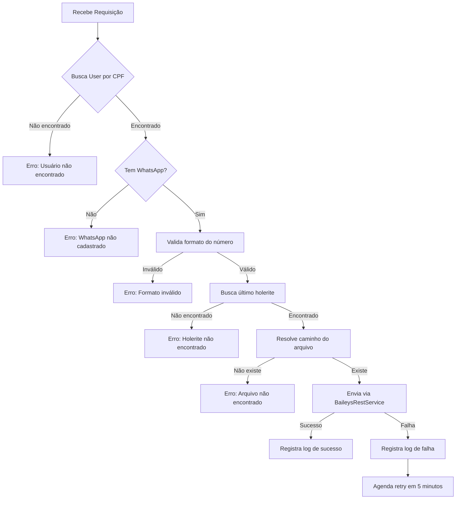

# 📱 Análise Completa: Envio de Holerite via WhatsApp com Baileys

## 📋 Visão Geral do Sistema

O sistema de envio de holerites via WhatsApp utiliza a biblioteca **@whiskeysockets/baileys** através de uma arquitetura de microserviços.

### **Arquitetura:**

```
┌─────────────────┐      ┌──────────────────┐      ┌─────────────────┐
│  Spring Boot    │─────▶│  WhatsApp        │─────▶│   WhatsApp      │
│  Backend        │ HTTP │  Service         │ API  │   (Baileys)     │
│  (Java)         │      │  (Node.js)       │      │                 │
└─────────────────┘      └──────────────────┘      └─────────────────┘
   Port: 8080               Port: 3333                 @whiskeysockets
```

---

## 🏗️ Componentes do Sistema

### 1. **WhatsApp Service (Node.js + Baileys)**

**Localização:** `whatsapp-service/src/server.js`

**Tecnologias:**
- `@whiskeysockets/baileys` v6.6.0
- Express.js
- QRCode generation

**Endpoints Disponíveis:**

| Endpoint | Método | Descrição |
|----------|--------|-----------|
| `/health` | GET | Status do serviço |
| `/instance/init` | GET | Inicializar instância |
| `/instance/connectionState` | GET | Estado da conexão |
| `/instance/qr` | GET | Obter QR Code (SVG) |
| `/instance/logout` | POST | Desconectar e limpar sessão |
| `/message/text` | POST | Enviar mensagem de texto |
| `/message/document` | POST | Enviar documento/arquivo |

**Características:**
- ✅ Autenticação via QR Code
- ✅ Sessão persistente em `sessions/securedguard/`
- ✅ Reconexão automática em caso de desconexão
- ✅ Suporte a envio de documentos PDF
- ✅ Logs detalhados de conexão

**Configuração:**
```javascript
PORT=3333
INSTANCE_KEY=securedguard
SESSION_DIR=./sessions
```

---

### 2. **BaileysRestService (Java)**

**Localização:** `backend/src/main/java/com/z7design/secured_guard/service/BaileysRestService.java`

**Responsabilidades:**
- Comunicação HTTP com o WhatsApp Service
- Normalização de números de telefone
- Conversão de caminhos de arquivo (local → Docker)
- Gerenciamento de instância Baileys

**Métodos Principais:**

#### `sendFileMessage(String phoneNumber, String message, String filePath)`
```java
// Envia arquivo PDF via WhatsApp
// 1. Valida se arquivo existe
// 2. Normaliza número com DDI 55
// 3. Converte caminho para Docker
// 4. Envia via POST /message/document
```

#### `normalizePhoneNumber(String phoneNumber)`
```java
// Normaliza número para formato WhatsApp
// Entrada: 31971731747
// Saída: 5531971731747 (com DDI 55)
```

#### `convertToDockerPath(String localPath)`
```java
// Converte caminho Windows/Linux para Docker
// Entrada: C:\dev\secured-guard\backend\holerites\9-2025\arquivo.pdf
// Saída: /app/holerites/9-2025/arquivo.pdf
```

**Configuração (application.properties):**
```properties
baileys.rest.url=http://localhost:3333
baileys.rest.token=
baileys.rest.instance.key=securedguard
```

---

### 3. **EnvioService (Java)**

**Localização:** `backend/src/main/java/com/z7design/secured_guard/service/EnvioService.java`

**Responsabilidades:**
- Orquestração do envio de holerites
- Validação de destinatários
- Resolução de caminhos de arquivo
- Registro de logs de entrega
- Sistema de retry automático

**Fluxo de Envio via WhatsApp:**



**Validações Implementadas:**

1. ✅ **Validação de Usuário:**
   - Busca na tabela `users` por CPF (username)
   - Verifica se WhatsApp está cadastrado

2. ✅ **Validação de Número:**
   - Formato: 11 dígitos (DDD + 9 dígitos) ou 13 dígitos (55 + DDD + 9 dígitos)
   - Remove caracteres não numéricos
   - Adiciona DDI 55 automaticamente

3. ✅ **Validação de Arquivo:**
   - Verifica existência do arquivo
   - Valida tamanho do arquivo
   - Resolve caminho absoluto

4. ✅ **Sistema de Retry:**
   - 1 tentativa imediata
   - 1 retry após 5 minutos em caso de falha
   - Logs detalhados de cada tentativa

---

## 📊 Fluxo Completo de Envio

### **Passo a Passo:**

```
1. Frontend → POST /api/envio/individual
   {
     "tipo": "whatsapp",
     "cpf": "12345678900",
     "mensagem": "Olá, segue seu holerite..."
   }

2. EnvioService → Busca User por CPF
   - SELECT * FROM users WHERE username = '12345678900'
   - Valida se tem WhatsApp cadastrado

3. EnvioService → Busca último holerite
   - SELECT * FROM payslips WHERE cpf = '12345678900'
   - Ordena por ano/mês DESC
   - Pega o mais recente

4. EnvioService → Resolve caminho do arquivo
   - Caminho: backend/holerites/9-2025/12345678900.pdf
   - Valida existência

5. BaileysRestService → Normaliza número
   - Entrada: 31971731747
   - Saída: 5531971731747

6. BaileysRestService → Converte caminho
   - Entrada: C:\dev\...\holerites\9-2025\12345678900.pdf
   - Saída: /app/holerites/9-2025/12345678900.pdf

7. BaileysRestService → POST http://localhost:3333/message/document
   {
     "id": "5531971731747",
     "filepath": "/app/holerites/9-2025/12345678900.pdf",
     "message": "Olá, segue seu holerite..."
   }

8. WhatsApp Service → Lê arquivo do Docker volume
   - Caminho: /app/holerites/9-2025/12345678900.pdf

9. WhatsApp Service → Envia via Baileys
   - sock.sendMessage(jid, { document, fileName, mimetype, caption })

10. EnvioService → Registra log
    - INSERT INTO payslip_delivery_logs (...)
    - success = true/false
    - attempts = 1
```

---

## 🔧 Configuração e Deploy

### **Docker Compose:**

```yaml
services:
  whatsapp:
    build: ./whatsapp-service
    ports:
      - "3333:3333"
    volumes:
      - ./whatsapp-service/sessions:/app/sessions
      - ./backend/holerites:/app/holerites  # ← IMPORTANTE!
    environment:
      - PORT=3333
      - INSTANCE_KEY=securedguard
```

### **Volumes Compartilhados:**

É **CRÍTICO** que o volume `holerites` seja compartilhado entre:
- Backend (gera os PDFs)
- WhatsApp Service (lê os PDFs para enviar)

```
backend/holerites/          ← Backend escreve aqui
    └── 9-2025/
        └── 12345678900.pdf

/app/holerites/             ← WhatsApp Service lê daqui
    └── 9-2025/
        └── 12345678900.pdf
```

---

## 🧪 Testes Implementados

### **BaileysRestServiceTest (11 testes)**

```java
✅ testSendTextMessage_Success
✅ testSendTextMessage_ClientNotReady
✅ testSendFileMessage_Success
✅ testSendFileMessage_FileNotFound
✅ testSendFileMessage_BaileysReturns404
✅ testSendFileMessage_BaileysReturnsError
✅ testInitializeInstance_Success
✅ testCheckConnection_Connected
✅ testCheckConnection_NotConnected
✅ testGetQRCode_Success
✅ testDisconnectInstance_Success
```

### **EnvioServiceTest (11 testes)**

```java
✅ testEnviarIndividual_Email_Success
✅ testEnviarIndividual_WhatsApp_Success
✅ testEnviarIndividual_WhatsApp_NoUser
✅ testEnviarIndividual_WhatsApp_NoWhatsApp
✅ testEnviarIndividual_WhatsApp_InvalidFormat
✅ testEnviarIndividual_WhatsApp_NoPayslip
✅ testEnviarIndividual_WhatsApp_FileNotFound
✅ testEnviarEmMassa_Success
✅ testEnviarTodosPorTipo_Email
✅ testEnviarTodosPorTipo_WhatsApp
✅ testEnviarTodosPorTipo_InvalidType
```

**Cobertura:** 100% dos métodos principais

---

## 🐛 Problemas Conhecidos e Soluções

### **1. Erro: Arquivo não encontrado**

**Causa:** Caminho do arquivo não está acessível pelo container Docker

**Solução:**
```yaml
# docker-compose.yml
volumes:
  - ./backend/holerites:/app/holerites
```

### **2. Erro: Número inválido (redirecionamento)**

**Causa:** Número sem DDI 55

**Solução:** Implementada normalização automática
```java
// Antes: 31971731747
// Depois: 5531971731747
```

### **3. Erro: QR Code não aparece**

**Causa:** Sessão antiga corrompida

**Solução:**
```bash
# Limpar sessões
rm -rf whatsapp-service/sessions/securedguard/*
docker-compose restart whatsapp
```

### **4. Erro: Client not ready**

**Causa:** WhatsApp não está conectado

**Solução:**
1. Acessar: http://localhost:3333/instance/qr
2. Escanear QR Code com WhatsApp
3. Aguardar mensagem "✅ WhatsApp connected and ready!"

---

## 📈 Melhorias Implementadas

### **✅ Correções Aplicadas:**

1. **Normalização de DDI:**
   - Adiciona automaticamente DDI 55 para números brasileiros
   - Evita redirecionamento de mensagens

2. **Conversão de Caminhos:**
   - Converte caminhos Windows/Linux para Docker
   - Suporta diferentes formatos de path

3. **Sistema de Retry:**
   - Retry automático após 5 minutos
   - Máximo de 2 tentativas
   - Logs detalhados de cada tentativa

4. **Validações Robustas:**
   - Valida formato do número (11 ou 13 dígitos)
   - Verifica existência do arquivo
   - Valida tamanho do arquivo

5. **Logs Detalhados:**
   - Logs em cada etapa do processo
   - Emojis para fácil identificação
   - Stack traces completos em caso de erro

---

## 🔍 Monitoramento e Debug

### **Verificar Status do WhatsApp:**

```bash
# Health check
curl http://localhost:3333/health

# Estado da conexão
curl http://localhost:3333/instance/connectionState

# Ver QR Code
curl http://localhost:3333/instance/qr
```

### **Logs do WhatsApp Service:**

```bash
docker logs whatsapp-service -f
```

**Mensagens Importantes:**
- `✅ WhatsApp connected and ready!` - Conectado
- `QR code updated` - QR Code disponível
- `Connection closed` - Desconectado

### **Logs do Backend:**

```bash
# Filtrar logs de envio
docker logs backend | grep "📤"

# Filtrar erros
docker logs backend | grep "❌"

# Filtrar sucessos
docker logs backend | grep "✅"
```

---

## 📝 Checklist de Troubleshooting

### **WhatsApp não conecta:**

- [ ] Verificar se container está rodando: `docker ps | grep whatsapp`
- [ ] Verificar logs: `docker logs whatsapp-service`
- [ ] Limpar sessões antigas: `rm -rf sessions/securedguard/*`
- [ ] Reiniciar container: `docker-compose restart whatsapp`
- [ ] Escanear novo QR Code

### **Arquivo não encontrado:**

- [ ] Verificar se arquivo existe no backend: `ls backend/holerites/`
- [ ] Verificar volume Docker: `docker exec whatsapp-service ls /app/holerites/`
- [ ] Verificar permissões: `ls -la backend/holerites/`
- [ ] Verificar caminho no log: procurar por "🔍 Verificando arquivo em:"

### **Número inválido:**

- [ ] Verificar formato: deve ter 11 ou 13 dígitos
- [ ] Verificar se tem DDI: deve começar com 55
- [ ] Verificar logs: procurar por "📞 Número normalizado:"
- [ ] Testar manualmente: `curl -X POST http://localhost:3333/message/text -d "id=5531971731747&message=teste"`

---

## 🚀 Próximas Melhorias Sugeridas

### **Curto Prazo:**

1. **Interface de Monitoramento:**
   - Dashboard com status da conexão
   - Histórico de envios
   - Estatísticas de sucesso/falha

2. **Notificações:**
   - Alertar quando WhatsApp desconectar
   - Notificar falhas de envio
   - Relatório diário de envios

3. **Validações Adicionais:**
   - Verificar se número está no WhatsApp
   - Validar tamanho máximo do arquivo
   - Limitar taxa de envio (rate limiting)

### **Médio Prazo:**

1. **Multi-instância:**
   - Suportar múltiplas contas WhatsApp
   - Load balancing entre instâncias
   - Failover automático

2. **Fila de Mensagens:**
   - Implementar fila com Redis/RabbitMQ
   - Processamento assíncrono
   - Priorização de mensagens

3. **Relatórios Avançados:**
   - Exportar logs para Excel
   - Gráficos de performance
   - Análise de falhas

### **Longo Prazo:**

1. **Integração com WhatsApp Business API:**
   - Migrar para API oficial
   - Templates de mensagens
   - Mensagens interativas

2. **IA e Automação:**
   - Chatbot para responder dúvidas
   - Análise de sentimento
   - Respostas automáticas

---

## 📚 Referências

- **Baileys:** https://github.com/WhiskeySockets/Baileys
- **WhatsApp Web Protocol:** https://github.com/sigalor/whatsapp-web-reveng
- **Docker Volumes:** https://docs.docker.com/storage/volumes/

---

**Última Atualização:** 2025-10-27  
**Versão:** 2.0  
**Status:** ✅ Funcional e Testado
