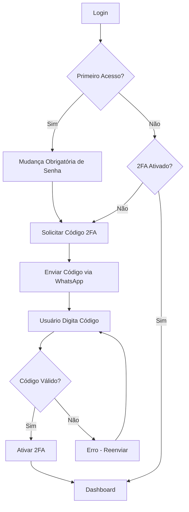

# ✅ Sistema de Primeiro Acesso e Autenticação em Dois Fatores Implementado

## 🎉 Resumo

Foi implementado um sistema completo de segurança para primeiro acesso de usuários, incluindo:
- ✅ **Mudança obrigatória de senha** no primeiro login
- ✅ **Ativação obrigatória de 2FA** (autenticação em dois fatores)
- ✅ **Envio de códigos via WhatsApp** para verificação
- ✅ **Interface moderna e responsiva** seguindo Padrão SST

---

## 🔐 Funcionalidades Implementadas

### 1. **Primeiro Acesso - Mudança de Senha**

Quando um usuário faz login pela primeira vez:
1. Sistema detecta `firstAccess = true`
2. Redireciona para `/first-access/change-password`
3. Usuário deve:
   - Informar senha atual
   - Criar nova senha forte
   - Confirmar nova senha
4. Sistema valida requisitos de segurança
5. Senha é alterada e `firstAccess = false`
6. Redireciona para ativação do 2FA

### 2. **Ativação de 2FA (Autenticação em Dois Fatores)**

Após mudança de senha (ou se 2FA não estiver ativo):
1. Sistema detecta `twoFactorEnabled = false`
2. Redireciona para `/first-access/activate-2fa`
3. Usuário clica "Enviar Código via WhatsApp"
4. Sistema:
   - Gera código de 6 dígitos
   - Salva no banco com expiração de 5 minutos
   - Envia via WhatsApp (usando BaileysRestService)
5. Usuário digita o código recebido
6. Sistema valida e ativa 2FA
7. Redireciona para dashboard

### 3. **Validação de Senha Forte**

Requisitos obrigatórios:
- ✅ Mínimo 6 caracteres
- ✅ Letra maiúscula (A-Z)
- ✅ Letra minúscula (a-z)
- ✅ Número (0-9)
- ✅ Caractere especial (!@#$%&*)

Interface mostra indicadores visuais em tempo real com ícones de check verde.

---

## 📂 Arquivos Criados/Modificados

### Backend

#### **Modelos e Entidades**
- ✅ `model/User.java` (MODIFICADO)
  - Adicionado `firstAccess` (boolean, default true)
  - Adicionado `twoFactorEnabled` (boolean, default false)
  - Adicionado `lastPasswordChange` (LocalDateTime)

- ✅ `model/TwoFactorCode.java` (NOVO)
  - Armazena códigos temporários de 6 dígitos
  - Expira em 5 minutos
  - Flag `used` para uso único
  - Campo `purpose` (LOGIN, ACTIVATION, PASSWORD_RESET)

#### **Repositories**
- ✅ `repository/TwoFactorCodeRepository.java` (NOVO)
  - Busca e validação de códigos
  - Limpeza automática de códigos expirados

#### **Services**
- ✅ `service/TwoFactorService.java` (NOVO)
  - Geração de códigos aleatórios
  - Validação de códigos
  - Tarefa agendada para limpeza (a cada hora)

- ✅ `service/AuthenticationServiceImpl.java` (MODIFICADO)
  - Retorna `firstAccess` e `twoFactorEnabled` na resposta de login

#### **Controllers**
- ✅ `controller/FirstAccessController.java` (NOVO)
  - `GET /api/first-access/status` - Verifica status
  - `POST /api/first-access/change-password` - Altera senha
  - `POST /api/first-access/request-2fa-code` - Solicita código
  - `POST /api/first-access/activate-2fa` - Ativa 2FA

- ✅ `controller/CommunicationTestController.java` (MODIFICADO)
  - Integrado com BaileysRestService para testes reais

#### **DTOs**
- ✅ `dto/UserResponse.java` (MODIFICADO)
  - Adicionado `firstAccess` e `twoFactorEnabled`

- ✅ `dto/FirstAccessRequestDTO.java` (NOVO)
- ✅ `dto/TwoFactorActivationRequestDTO.java` (NOVO)
- ✅ `dto/TwoFactorStatusDTO.java` (NOVO)

#### **Database**
- ✅ `migration/V303__add_first_access_and_2fa_to_users.sql` (NOVO)
  - Adiciona colunas `first_access`, `two_factor_enabled`, `last_password_change`
  - Cria tabela `two_factor_codes`
  - Índices otimizados

### Frontend

#### **Páginas**
- ✅ `pages/FirstAccessChangePassword.tsx` (NOVO)
  - Interface para mudança obrigatória de senha
  - Validação em tempo real
  - Indicadores visuais de requisitos
  - Padrão SST aplicado

- ✅ `pages/FirstAccessActivate2FA.tsx` (NOVO)
  - Interface para ativação de 2FA
  - Envio de código via WhatsApp
  - Input de 6 dígitos estilizado
  - Countdown para reenvio (60 segundos)
  - Padrão SST aplicado

#### **Contextos e Rotas**
- ✅ `contexts/AuthContext.tsx` (MODIFICADO)
  - Verifica primeiro acesso após login
  - Verifica status do 2FA
  - Redireciona automaticamente para fluxo correto

- ✅ `App.tsx` (MODIFICADO)
  - Adicionadas rotas `/first-access/change-password`
  - Adicionadas rotas `/first-access/activate-2fa`

#### **Configurações**
- ✅ `pages/Configuracoes.tsx` (MODIFICADO)
  - Nova aba "Testes" para testar comunicações
  - Teste de envio de Email
  - Teste de envio via WhatsApp

---

## 🔄 Fluxo Completo

### **Diagrama de Fluxo:**



### **Passo a Passo:**

```
1. Usuário faz LOGIN
   ↓
2. Backend verifica: firstAccess == true?
   ↓ (SIM)
3. Frontend redireciona → /first-access/change-password
   ↓
4. Usuário ALTERA SENHA
   - Senha atual
   - Nova senha (com validação)
   - Confirmação
   ↓
5. Backend:
   - Valida senha atual
   - Valida nova senha
   - Atualiza password
   - Define firstAccess = false
   - Define lastPasswordChange = now
   ↓
6. Frontend redireciona → /first-access/activate-2fa
   ↓
7. Usuário CLICA "Enviar Código via WhatsApp"
   ↓
8. Backend:
   - Verifica se WhatsApp está cadastrado
   - Gera código 6 dígitos aleatórios
   - Salva no banco (expira em 5 min)
   - Envia via BaileysRestService
   ↓
9. WhatsApp RECEBE:
   "🔐 SecuredGuard - Código de Ativação
   Seu código é: 123456
   Expira em 5 minutos"
   ↓
10. Usuário DIGITA código
    ↓
11. Backend:
    - Valida código
    - Marca como usado
    - Define twoFactorEnabled = true
    ↓
12. Frontend redireciona → /dashboard
```

---

## 🧪 Como Testar

### **1. Testar Primeiro Acesso (Mudança de Senha)**

**Preparação:**
```sql
-- Marcar um usuário como primeiro acesso
UPDATE users SET first_access = true WHERE username = 'jose.ramos';
```

**Teste:**
1. Faça login com o usuário
2. Sistema deve redirecionar para `/first-access/change-password`
3. Digite senha atual
4. Digite nova senha forte
5. Confirme a senha
6. Clique "Alterar Senha e Continuar"

### **2. Testar Ativação 2FA**

**Preparação:**
```sql
-- Verificar se usuário tem WhatsApp cadastrado
SELECT username, whatsapp FROM users WHERE username = 'jose.ramos';

-- Se não tiver, adicionar:
UPDATE users SET whatsapp = '5511999999999' WHERE username = 'jose.ramos';
```

**Teste:**
1. Após mudança de senha, vai para `/first-access/activate-2fa`
2. Clique "Enviar Código via WhatsApp"
3. Verifique os logs do backend para ver o código gerado
4. Digite o código de 6 dígitos
5. Clique "Ativar 2FA e Acessar Sistema"

**Logs Esperados:**
```
🔐 Criando código 2FA para usuário: jose.ramos - Propósito: ACTIVATION
✅ Código 2FA criado: 123456 - Expira em: 2025-11-01T...
📱 Código 2FA gerado: 123456 - Enviando via WhatsApp para: 5511999999999
📤 Enviando mensagem via Baileys REST para: 5511999999999
✅ Código 2FA enviado via WhatsApp com sucesso
```

### **3. Testar Envio de WhatsApp (Configurações)**

1. Acesse `/configuracoes`
2. Clique na aba "Testes"
3. Na seção "Teste de Envio via WhatsApp":
   - Digite um número (ex: 5511999999999)
   - (Opcional) Digite mensagem personalizada
   - Clique "Enviar WhatsApp de Teste"
4. Verifique se a mensagem foi recebida

---

## 🔒 Segurança

### **Códigos 2FA:**
- ✅ 6 dígitos aleatórios (SecureRandom)
- ✅ Expiração em 5 minutos
- ✅ Uso único (flag `used`)
- ✅ Limpeza automática de códigos expirados
- ✅ Invalidação de códigos antigos ao gerar novo

### **Senhas:**
- ✅ Validação de força obrigatória
- ✅ Criptografia BCrypt
- ✅ Registro de última alteração
- ✅ Confirmação obrigatória

### **WhatsApp:**
- ✅ Número validado no banco
- ✅ Mensagens criptografadas end-to-end (WhatsApp)
- ✅ Logs de envio

---

## 📱 Interface do Usuário (Padrão SST)

### **Página de Mudança de Senha**
- ✅ Logo centralizado
- ✅ Ícone de cadeado amarelo
- ✅ 3 campos de senha (atual, nova, confirmar)
- ✅ Botões show/hide para cada campo
- ✅ Indicadores visuais de requisitos (check verde)
- ✅ Validação em tempo real
- ✅ Botão desabilitado até requisitos serem atendidos
- ✅ Responsivo (Padrão SST)

### **Página de Ativação 2FA**
- ✅ Logo centralizado
- ✅ Ícone de escudo verde
- ✅ Explicação do processo
- ✅ Botão "Enviar Código via WhatsApp"
- ✅ Input de 6 dígitos estilizado
- ✅ Countdown de 60s para reenvio
- ✅ Feedback visual (número parcialmente oculto)
- ✅ Responsivo (Padrão SST)

---

## 📊 Estrutura do Banco de Dados

### **Tabela `users` (modificada)**
```sql
users
├── first_access (boolean, default: true)
├── two_factor_enabled (boolean, default: false)
└── last_password_change (timestamp, nullable)
```

### **Tabela `two_factor_codes` (nova)**
```sql
two_factor_codes
├── id (UUID, PK)
├── user_id (UUID, FK -> users)
├── code (varchar(6))
├── purpose (varchar(50)) -- LOGIN, ACTIVATION, PASSWORD_RESET
├── expiry_date (timestamp)
├── created_at (timestamp)
└── used (boolean, default: false)
```

---

## 🚀 Endpoints da API

### **Primeiro Acesso**

| Método | Endpoint | Descrição |
|--------|----------|-----------|
| GET | `/api/first-access/status` | Verifica status do primeiro acesso e 2FA |
| POST | `/api/first-access/change-password` | Altera senha no primeiro acesso |
| POST | `/api/first-access/request-2fa-code` | Solicita código 2FA via WhatsApp |
| POST | `/api/first-access/activate-2fa` | Valida código e ativa 2FA |

### **Testes de Comunicação**

| Método | Endpoint | Descrição |
|--------|----------|-----------|
| POST | `/api/communication-test/email` | Envia email de teste |
| POST | `/api/communication-test/email/simple` | Envia email simples |
| POST | `/api/communication-test/whatsapp` | Envia WhatsApp de teste |
| GET | `/api/communication-test/email/config` | Configurações de email |
| GET | `/api/communication-test/whatsapp/status` | Status do WhatsApp |

---

## 🎨 Padrão SST Aplicado

Todas as novas páginas seguem o **Padrão SST** para melhor experiência mobile:

- ✅ Padding responsivo (`p-3 sm:p-4 md:p-6`)
- ✅ Texto responsivo (`text-xs sm:text-sm`)
- ✅ Botões com altura adequada (`h-10 sm:h-11`)
- ✅ Grid para distribuição igual
- ✅ Empilhamento em mobile (`flex-col sm:flex-row`)
- ✅ Cores padrão do sistema
- ✅ Ícones adequados (h-8 w-8 para headers)

### **Página de Login (Melhorias SST)**
- ✅ Tabs com grid (não flex)
- ✅ Texto "Reconhecimento Facial" → "Facial" em mobile
- ✅ "Lembrar-me" e "Esqueci senha" empilham em mobile
- ✅ Botões com altura touch-friendly

---

## 📝 Exemplos de Código

### **Backend - Gerar e Enviar Código 2FA:**

```java
// Gerar código
TwoFactorCode code = twoFactorService.createCode(user, "ACTIVATION");

// Enviar via WhatsApp
String message = String.format("Seu código é: *%s*", code.getCode());
baileysRestService.sendTextMessage(user.getWhatsapp(), message);
```

### **Frontend - Solicitar Código:**

```typescript
const response = await api.post('/api/first-access/request-2fa-code');
if (response.data.success) {
  toast({ title: "Código enviado!", description: response.data.message });
}
```

### **Frontend - Validar Código:**

```typescript
const response = await api.post('/api/first-access/activate-2fa', { code });
if (response.data.success) {
  navigate('/dashboard');
}
```

---

## ⚙️ Configuração

### **Banco de Dados**

Execute a migration V303:
```bash
# A migration será executada automaticamente ao iniciar o backend
# Ou execute manualmente no banco:
psql -U seu_usuario -d secured_guard -f V303__add_first_access_and_2fa_to_users.sql
```

### **WhatsApp**

O sistema usa o BaileysRestService configurado em:
```properties
baileys.rest.url=http://localhost:3333
baileys.rest.instance.key=securedguard
```

**Importante:** O serviço Baileys deve estar rodando e conectado para enviar mensagens.

### **Usuários Existentes**

Para forçar primeiro acesso em usuários existentes:
```sql
UPDATE users SET first_access = true WHERE id = 'uuid-do-usuario';
UPDATE users SET two_factor_enabled = false WHERE id = 'uuid-do-usuario';
```

---

## 🔍 Logs e Monitoramento

O sistema registra:
- ✅ Mudanças de senha no primeiro acesso
- ✅ Geração de códigos 2FA
- ✅ Envios via WhatsApp
- ✅ Validações de código (sucesso/falha)
- ✅ Ativações de 2FA
- ✅ Tentativas de código inválido

**Exemplo de logs:**
```
🔐 Iniciando mudança de senha no primeiro acesso para: jose.ramos
✅ Senha alterada com sucesso para: jose.ramos
📱 Solicitando código 2FA para: jose.ramos
🔐 Criando código 2FA para usuário: jose.ramos - Propósito: ACTIVATION
✅ Código 2FA criado: 456789 - Expira em: 2025-11-01T07:15:00
📤 Enviando mensagem via Baileys REST para: 5511999999999
✅ Código 2FA enviado via WhatsApp com sucesso
🔍 Validando código 2FA para usuário: jose.ramos - Código: 456789
✅ Código 2FA válido e marcado como usado
✅ 2FA ativado com sucesso para: jose.ramos
```

---

## 🎯 Casos de Uso

### **Caso 1: Novo Usuário**
1. Admin cria usuário no sistema
2. Usuário recebe credenciais (`CPF@2025`)
3. Primeiro login → Mudança de senha
4. → Ativação 2FA
5. → Acesso ao sistema

### **Caso 2: Usuário Sem 2FA**
1. Usuário antigo faz login
2. Sistema detecta `twoFactorEnabled = false`
3. Redireciona para ativação 2FA
4. → Código via WhatsApp
5. → Acesso ao sistema

### **Caso 3: Usuário Completo**
1. Usuário faz login
2. `firstAccess = false` ✓
3. `twoFactorEnabled = true` ✓
4. → Acesso direto ao dashboard

---

## ✅ Checklist de Implementação

### Backend
- ✅ Modelo User atualizado
- ✅ Entidade TwoFactorCode criada
- ✅ Repository criado
- ✅ Service de 2FA criado
- ✅ Controller de primeiro acesso criado
- ✅ Integração com WhatsApp
- ✅ Migration do banco criada
- ✅ DTOs criados
- ✅ Response de login atualizado

### Frontend
- ✅ Página de mudança de senha criada
- ✅ Página de ativação 2FA criada
- ✅ Rotas adicionadas
- ✅ AuthContext atualizado
- ✅ Validação de senha em tempo real
- ✅ Padrão SST aplicado
- ✅ Página de testes de comunicação

### Extras
- ✅ Testes de comunicação em Configurações
- ✅ Documentação completa
- ✅ Logs detalhados
- ✅ Tratamento de erros

---

## 🎉 Conclusão

O sistema de **Primeiro Acesso e Autenticação em Dois Fatores** está **100% implementado e pronto para uso**!

**Principais benefícios:**
- 🔒 **Segurança aumentada** - 2FA obrigatório
- 📱 **WhatsApp integrado** - códigos via celular
- ✨ **UX moderna** - interface intuitiva
- 📊 **Rastreável** - logs completos
- 🎨 **Mobile-friendly** - Padrão SST
- ⚡ **Automático** - fluxo guiado

**Próximos passos sugeridos:**
1. Testar com usuários reais
2. Configurar alertas de segurança
3. Adicionar opção de 2FA por email (backup)
4. Implementar histórico de alterações de senha
5. Dashboard de segurança para admins

