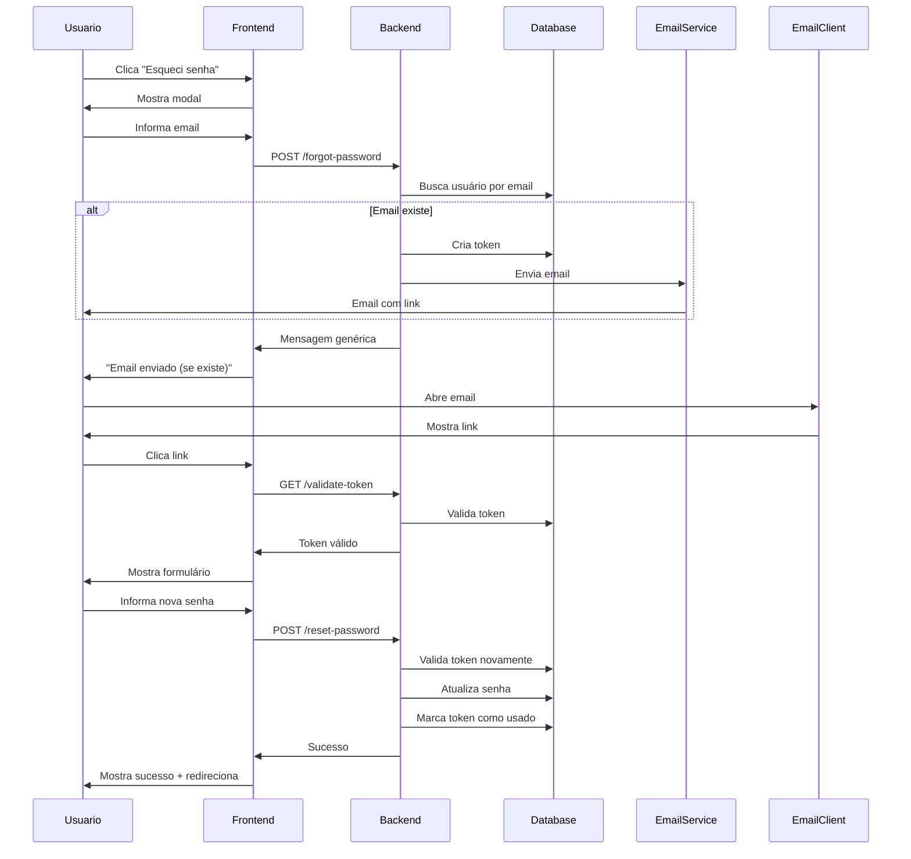

# Funcionalidade de Recuperação de Senha Implementada ✅

## 📋 Resumo

Foi implementada a funcionalidade completa de recuperação de senha no sistema SecuredGuard, permitindo que usuários que esqueceram suas senhas possam redefini-las através de um link enviado por email.

## 🎯 Funcionalidades Implementadas

### Backend (Spring Boot)

#### 1. **Entidade PasswordResetToken**
- Armazena tokens de recuperação de senha
- Campos:
  - `id` (UUID)
  - `token` (String única)
  - `user_id` (referência ao usuário)
  - `expiry_date` (data/hora de expiração - 1 hora)
  - `created_at` (data de criação)
  - `used` (flag indicando se já foi usado)

#### 2. **PasswordResetTokenRepository**
- Repository JPA para gerenciar tokens
- Métodos:
  - `findByToken()` - busca token específico
  - `deleteByExpiryDateBefore()` - limpa tokens expirados
  - `deleteByUserId()` - remove tokens antigos do usuário

#### 3. **PasswordResetService**
- Lógica de negócio para recuperação de senha
- Métodos principais:
  - `createPasswordResetToken()` - cria token e envia email
  - `resetPassword()` - valida token e redefine senha
  - `validateToken()` - verifica validade do token
  - `cleanupExpiredTokens()` - tarefa agendada (diária às 2h)

#### 4. **EmailService (atualizado)**
- Novo método `sendPasswordResetEmail()` - envia email com link de recuperação
- Email HTML responsivo com:
  - Link clicável para redefinição
  - Instruções claras
  - Avisos de segurança
  - Tempo de expiração (1 hora)

#### 5. **AuthenticationController (atualizado)**
- Novos endpoints públicos:
  - `POST /api/auth/forgot-password` - solicita recuperação
  - `POST /api/auth/reset-password` - redefine senha
  - `GET /api/auth/validate-reset-token` - valida token

#### 6. **DTOs Criados**
- `ForgotPasswordRequestDTO` - requisição de recuperação
- `ResetPasswordRequestDTO` - redefinição de senha
- `MessageResponseDTO` - resposta padrão

#### 7. **Migration de Banco**
- `V302__create_password_reset_tokens_table.sql`
- Cria tabela com índices otimizados
- Foreign key com CASCADE DELETE

### Frontend (React/TypeScript)

#### 1. **Página Login (atualizada)**
- Link "Esqueci minha senha" funcional
- Modal para solicitar recuperação:
  - Campo para email
  - Validação
  - Feedback visual
  - Mensagem genérica por segurança

#### 2. **Nova Página ResetPassword**
- URL: `/reset-password?token=xxx`
- Validação automática do token
- Formulário de redefinição:
  - Campo nova senha (com show/hide)
  - Campo confirmar senha
  - Validação de força da senha
  - Indicadores visuais de requisitos
- Estados:
  - Validando token (loading)
  - Token inválido (erro com link para voltar)
  - Formulário (entrada de nova senha)
  - Sucesso (com redirecionamento automático)

#### 3. **App.tsx (atualizado)**
- Nova rota pública `/reset-password`
- Lazy loading da página

## 🔧 Configuração

### Backend

Adicionar no `application.properties` (ou sobrescrever via variável de ambiente):

```properties
# URL do frontend para links de recuperação
app.frontend.url=http://localhost:5173
```

Para produção:
```bash
export FRONTEND_URL=https://seudominio.com
```

### Email

As configurações de email já estão no `application.properties`:
```properties
spring.mail.host=mail.z7design.com.br
spring.mail.port=465
spring.mail.username=securedguard@z7design.com.br
```

## 🔒 Segurança

1. **Token único e aleatório** (UUID)
2. **Expiração em 1 hora**
3. **Token usado apenas uma vez** (flag `used`)
4. **Email genérico** (não revela se email existe)
5. **Senha criptografada** com BCrypt
6. **Limpeza automática** de tokens expirados
7. **Validação de força da senha**

## 📝 Fluxo de Uso

### Usuário

1. Acessa `/login`
2. Clica em "Esqueci minha senha"
3. Informa email no modal
4. Recebe email com link (se email existir no sistema)
5. Clica no link do email
6. É direcionado para `/reset-password?token=xxx`
7. Informa nova senha (2x)
8. Senha é redefinida
9. Redireciona para login automaticamente

### Sistema



## 🧪 Como Testar

### 1. Testar Solicitação de Recuperação

**Via Frontend:**
1. Acesse `http://localhost:5173/login`
2. Clique em "Esqueci minha senha"
3. Digite um email cadastrado
4. Verifique o console do backend para ver o link gerado

**Via Postman/cURL:**
```bash
curl -X POST http://localhost:8081/api/auth/forgot-password \
  -H "Content-Type: application/json" \
  -d '{"email": "usuario@exemplo.com"}'
```

### 2. Testar Validação de Token

```bash
curl -X GET "http://localhost:8081/api/auth/validate-reset-token?token=SEU_TOKEN_AQUI"
```

### 3. Testar Redefinição de Senha

**Via Frontend:**
1. Copie o link do email (ou do log do backend)
2. Acesse o link no navegador
3. Digite a nova senha duas vezes
4. Clique em "Redefinir Senha"
5. Aguarde redirecionamento
6. Faça login com a nova senha

**Via Postman/cURL:**
```bash
curl -X POST http://localhost:8081/api/auth/reset-password \
  -H "Content-Type: application/json" \
  -d '{
    "token": "SEU_TOKEN_AQUI",
    "newPassword": "NovaSenha123!"
  }'
```

## 📧 Email de Recuperação

O email enviado contém:

- ✅ Design responsivo e profissional
- ✅ Logo do sistema
- ✅ Botão de ação destacado
- ✅ Link alternativo (caso botão não funcione)
- ✅ Aviso de expiração (1 hora)
- ✅ Instruções de segurança
- ✅ Dicas para senha forte

## 🎨 Interface do Usuário

### Modal de Recuperação
- Design consistente com o tema do sistema
- Campo de email com validação
- Botões de ação claros
- Feedback visual durante processamento

### Página de Redefinição
- Indicadores de força da senha em tempo real
- Validação de requisitos mínimos
- Botões de show/hide senha
- Estados visuais (loading, erro, sucesso)
- Redirecionamento automático após sucesso

## 🔍 Logs e Monitoramento

O sistema registra:
- ✅ Solicitações de recuperação (email)
- ✅ Tokens criados
- ✅ Emails enviados
- ✅ Validações de token
- ✅ Redefinições bem-sucedidas
- ✅ Tentativas de uso de token inválido/expirado

## 📚 Arquivos Criados/Modificados

### Backend
- ✅ `model/PasswordResetToken.java` (NOVO)
- ✅ `repository/PasswordResetTokenRepository.java` (NOVO)
- ✅ `service/PasswordResetService.java` (NOVO)
- ✅ `service/EmailService.java` (MODIFICADO)
- ✅ `controller/AuthenticationController.java` (MODIFICADO)
- ✅ `dto/ForgotPasswordRequestDTO.java` (NOVO)
- ✅ `dto/ResetPasswordRequestDTO.java` (NOVO)
- ✅ `dto/MessageResponseDTO.java` (NOVO)
- ✅ `resources/db/migration/V302__create_password_reset_tokens_table.sql` (NOVO)
- ✅ `resources/application.properties` (MODIFICADO)

### Frontend
- ✅ `pages/Login.tsx` (MODIFICADO)
- ✅ `pages/ResetPassword.tsx` (NOVO)
- ✅ `App.tsx` (MODIFICADO)

## 🚀 Próximos Passos (Opcional)

1. **Testes Automatizados**
   - Unit tests para PasswordResetService
   - Integration tests para endpoints
   - E2E tests para fluxo completo

2. **Melhorias**
   - Limite de tentativas por IP/email (rate limiting)
   - Histórico de alterações de senha
   - Notificação de alteração de senha
   - 2FA opcional

3. **Monitoramento**
   - Dashboard de tentativas de recuperação
   - Alertas de uso suspeito
   - Métricas de sucesso/falha

## ✅ Conclusão

A funcionalidade de recuperação de senha está **100% implementada e pronta para uso**. O sistema segue as melhores práticas de segurança e oferece uma experiência de usuário moderna e intuitiva.

