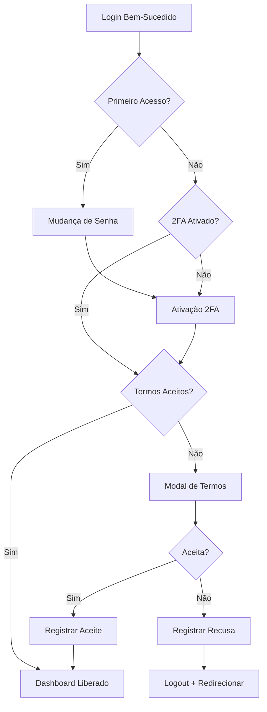

# ✅ Modal de Termos de Uso e Consentimento LGPD Implementado

## 🎯 Objetivo

Implementar um sistema de **aceite obrigatório de Termos de Uso e Política de Privacidade** com modal interativo usando radio buttons, conforme LGPD.

---

## ✅ O Que Foi Implementado

### 1. **Modal de Termos de Uso**

#### Características:
- ✅ Modal moderno e responsivo (Padrão SST)
- ✅ Scroll área para ler termos completos
- ✅ **2 opções com Radio Buttons:**
  - ✅ "Li e ACEITO os termos" (verde)
  - ✅ "NÃO ACEITO os termos" (vermelho)
- ✅ Validação obrigatória (deve escolher uma opção)
- ✅ Botão dinâmico que muda cor/texto conforme seleção
- ✅ Informação sobre registro de consentimento (IP, data, versão)

#### Conteúdo do Modal:
1. **Termos de Uso:**
   - Aceitação dos termos
   - Uso do sistema (responsabilidades)
   - Responsabilidades do usuário
   - Restrições e proibições

2. **Política de Privacidade (LGPD):**
   - Coleta de dados
   - Tipos de dados coletados
   - Uso e finalidade dos dados
   - Compartilhamento (ou não)
   - Direitos do usuário (LGPD)
   - Segurança da informação
   - Retenção de dados
   - Contato do DPO

---

### 2. **Fluxo de Aceite**

#### Se ACEITAR:
```
1. Usuário seleciona "ACEITO"
2. Clica "Aceitar e Continuar"
3. Sistema registra aceite no banco:
   - user_id, CPF
   - IP address
   - User agent
   - Data/hora
   - Versão dos termos
   - Hash do conteúdo
4. Modal fecha
5. Usuário pode usar o sistema normalmente ✅
```

#### Se RECUSAR:
```
1. Usuário seleciona "NÃO ACEITO"
2. Clica "Não Aceitar e Sair"
3. Sistema registra recusa no banco
4. Toast: "Termos não aceitos - Você será desconectado"
5. Logout automático
6. Redireciona para /login ❌
```

---

### 3. **Integração no Fluxo de Login**

#### Ordem de Verificações:
```
LOGIN
  ↓
Primeiro Acesso?
  ↓ NÃO
2FA Ativado?
  ↓ SIM
Termos Aceitos?
  ↓ NÃO
[MODAL DE TERMOS]
  ↓ ACEITAR
DASHBOARD (acesso liberado) ✅
```

#### Código (AuthContext):
```typescript
// Após login bem-sucedido:
1. Verifica firstAccess → redireciona se true
2. Verifica twoFactorEnabled → redireciona se false
3. Verifica termos aceitos → mostra modal se não aceitou
4. Se tudo OK → libera dashboard
```

---

## 📂 Arquivos Criados/Modificados

### Backend (JÁ EXISTENTE) ✅
- ✅ `model/UserTermsConsent.java` - Entidade
- ✅ `repository/UserTermsConsentRepository.java` - Repository
- ✅ `service/UserTermsConsentService.java` - Lógica de negócio
- ✅ `controller/UserTermsConsentController.java` - Endpoints
- ✅ `dto/UserTermsConsentDTO.java` - DTO
- ✅ `dto/CreateUserTermsConsentDTO.java` - DTO de criação
- ✅ `migration/create_user_terms_consent_table.sql` - Tabela no banco

### Frontend (NOVO) ✅
- ✅ `components/TermsConsentModal.tsx` - Modal interativo
- ✅ `components/TermsConsentGuard.tsx` - Wrapper de verificação
- ✅ `contexts/AuthContext.tsx` (MODIFICADO) - Verificação após login
- ✅ `App.tsx` (MODIFICADO) - Guard nas rotas

---

## 🎨 Interface do Modal (Padrão SST)

### **Visual do Modal:**

```
┌──────────────────────────────────────┐
│ 🛡️ Termos de Uso e Política          │
│ Olá, José. Leia e aceite...          │
├──────────────────────────────────────┤
│ [Área de Scroll]                     │
│                                      │
│ 📄 Termos de Uso                     │
│ 1. Aceitação dos Termos              │
│ 2. Uso do Sistema                    │
│ ...                                  │
│                                      │
│ 🔒 Política de Privacidade (LGPD)    │
│ 1. Coleta de Dados                   │
│ 2. Dados Coletados                   │
│ ...                                  │
│                                      │
├──────────────────────────────────────┤
│ ┌────────────────────────────────┐  │
│ │ ⚪ ✓ Li e ACEITO os termos    │  │ ← Radio verde
│ │   Concordo em cumprir...       │  │
│ └────────────────────────────────┘  │
│ ┌────────────────────────────────┐  │
│ │ ⚪ ✗ NÃO ACEITO os termos      │  │ ← Radio vermelho
│ │   Não poderei acessar...       │  │
│ └────────────────────────────────┘  │
│                                      │
│ ℹ️ Este consentimento é registrado  │
│                                      │
│ [Aceitar e Continuar]                │ ← Botão muda cor
└──────────────────────────────────────┘
```

### **Responsividade (Padrão SST):**

**Mobile:**
- Altura: `max-h-[90vh]` (90% da tela)
- Scroll área: `h-[50vh]`
- Textos: `text-xs sm:text-sm`
- Padding: `p-3 sm:p-4`
- Ícones: `h-4 w-4 sm:h-5 sm:w-5`

**Desktop:**
- Altura: `h-[60vh]`
- Largura: `max-w-2xl`
- Textos: `text-sm`
- Padding: `p-4`
- Ícones: `h-5 w-5`

---

## 🔒 Dados Registrados (LGPD)

### **Tabela `user_terms_consent`:**

```sql
user_terms_consent
├── id (UUID)
├── user_id (UUID)
├── user_type (ENUM: EMPLOYEE, SUPERVISOR, ADMIN)
├── user_cpf (String)
├── accepted (Boolean) ← true/false
├── accepted_at (Timestamp) ← quando aceitou
├── ip_address (String) ← IP do usuário
├── user_agent (String) ← Navegador
├── terms_version (String) ← "1.0.0"
├── privacy_policy_version (String) ← "1.0.0"
├── terms_content_hash (String) ← Hash SHA-256
└── created_at (Timestamp)
```

### **Auditoria e Conformidade:**
- ✅ **IP Address** - rastreável
- ✅ **User Agent** - dispositivo/navegador usado
- ✅ **Data/Hora** - momento exato do aceite
- ✅ **Versão** - qual versão dos termos foi aceita
- ✅ **Hash** - prova de integridade do conteúdo
- ✅ **CPF** - identificação única

---

## 🔄 Fluxo Completo

### **Diagrama:**



### **Passo a Passo:**

```
1. Usuário faz LOGIN
   ↓
2. Sistema verifica: firstAccess?
   ↓ (NÃO)
3. Sistema verifica: twoFactorEnabled?
   ↓ (SIM)
4. Sistema verifica: termos aceitos?
   ↓ (NÃO)
5. Sistema define: localStorage.setItem('needsTermsConsent', 'true')
6. Redireciona para /dashboard
   ↓
7. TermsConsentGuard detecta flag
8. Busca status no backend
9. MOSTRA MODAL ←
   ↓
10. Usuário LÊ termos
11. Usuário seleciona RADIO:
    [ ] Aceito
    [ ] Não Aceito
    ↓
12. Clica botão
    ↓
    SE ACEITAR:
    13a. POST /api/user-terms-consent/accept
    14a. Registra no banco
    15a. Remove flag do localStorage
    16a. Fecha modal
    17a. SISTEMA LIBERADO ✅
    
    SE RECUSAR:
    13b. POST /api/user-terms-consent/accept (accepted: false)
    14b. Toast: "Termos não aceitos"
    15b. Logout()
    16b. navigate('/login') ❌
```

---

## 📋 Endpoints Utilizados

### **Verificação:**
```
GET /api/user-terms-consent/check/{userId}/EMPLOYEE

Response:
{
  "hasAccepted": false,
  "isRequired": true,
  "userId": "uuid",
  "userType": "EMPLOYEE"
}
```

### **Aceite:**
```
POST /api/user-terms-consent/accept

Body:
{
  "userId": "uuid",
  "userType": "EMPLOYEE",
  "userCpf": "12345678901",
  "accepted": true
}

Response:
{
  "id": "uuid",
  "userId": "uuid",
  "accepted": true,
  "acceptedAt": "2025-11-01T10:30:00",
  "termsVersion": "1.0.0",
  ...
}
```

---

## 🧪 Como Testar

### **1. Simular usuário sem aceite:**

```sql
-- Deletar aceites anteriores (se existir)
DELETE FROM user_terms_consent WHERE user_cpf = '12345678901';

-- Ou marcar flag no localStorage manualmente após login
localStorage.setItem('needsTermsConsent', 'true');
```

### **2. Teste o Fluxo:**

```bash
1. Faça login no sistema
   ↓
2. Sistema deve mostrar modal de termos
   
3. TESTE ACEITAR:
   - Selecione "Li e ACEITO"
   - Clique "Aceitar e Continuar"
   - Modal fecha
   - Dashboard fica disponível ✅
   
4. TESTE RECUSAR:
   - Faça login novamente
   - Selecione "NÃO ACEITO"
   - Clique "Não Aceitar e Sair"
   - Toast de "Termos não aceitos"
   - Logout automático ✅
   - Redireciona para login
```

### **3. Verificar Registro:**

```sql
-- Ver aceites registrados
SELECT * FROM user_terms_consent ORDER BY created_at DESC;

-- Ver por usuário
SELECT * FROM user_terms_consent WHERE user_cpf = '12345678901';
```

**Deve mostrar:**
- ✅ user_id
- ✅ accepted (true/false)
- ✅ accepted_at (se aceitou)
- ✅ ip_address
- ✅ user_agent
- ✅ terms_version ("1.0.0")
- ✅ created_at

---

## 🎨 Componentes Criados

### **1. TermsConsentModal**

**Props:**
- `isOpen` - Controla visibilidade
- `onAccept` - Callback ao aceitar
- `onDecline` - Callback ao recusar
- `userName` - Nome do usuário (opcional)
- `loading` - Estado de carregamento

**Features:**
- ✅ Radio buttons estilizados
- ✅ Área de scroll para termos longos
- ✅ Validação de seleção obrigatória
- ✅ Botão que muda cor conforme seleção
- ✅ Alerta de erro se não selecionar
- ✅ Info box sobre registro de dados

### **2. TermsConsentGuard**

**Função:**
- Wrapper de rotas que verifica aceite
- Mostra modal se necessário
- Gerencia estado de loading
- Faz requisições ao backend
- Controla fluxo de aceite/recusa

**Uso:**
```tsx
<TermsConsentGuard>
  <DashboardComponent />
</TermsConsentGuard>
```

---

## 🔐 Segurança e LGPD

### **Conformidade LGPD:**

✅ **Art. 7º - Base Legal:** Consentimento expresso do titular
✅ **Art. 8º - Consentimento:** Forma escrita ou meio que demonstre manifestação de vontade
✅ **Art. 9º - Transparência:** Informações claras sobre tratamento de dados
✅ **Art. 18º - Direitos do Titular:** Todos os direitos listados no modal
✅ **Art. 48º - Segurança:** Medidas técnicas e administrativas implementadas

### **Registro de Consentimento:**

Cada aceite é registrado com:
1. **Quem**: user_id + CPF
2. **O quê**: accepted (true/false)
3. **Quando**: accepted_at (timestamp)
4. **Onde**: ip_address
5. **Como**: user_agent (navegador)
6. **Qual versão**: terms_version + privacy_policy_version
7. **Prova**: terms_content_hash (SHA-256)

Isso garante **rastreabilidade completa** para auditorias e processos judiciais.

---

## 📊 Estrutura do Backend (Já Existente)

### **Endpoints Disponíveis:**

| Método | Endpoint | Descrição | Acesso |
|--------|----------|-----------|--------|
| GET | `/api/user-terms-consent/check/{userId}/{userType}` | Verificar aceite | Público |
| GET | `/api/user-terms-consent/check-by-cpf/{cpf}/{userType}` | Verificar por CPF | Público |
| POST | `/api/user-terms-consent/accept` | Aceitar/Recusar | Público |
| GET | `/api/user-terms-consent/latest/{userId}/{userType}` | Último aceite | Admin |
| GET | `/api/user-terms-consent/all` | Listar todos | Admin |
| GET | `/api/user-terms-consent/accepted` | Listar aceitos | Admin |
| GET | `/api/user-terms-consent/by-type/{userType}` | Por tipo | Admin |
| GET | `/api/user-terms-consent/count/{userType}` | Contar aceites | Admin |
| GET | `/api/user-terms-consent/versions` | Versões atuais | Público |

### **Versões Atuais:**
```java
CURRENT_TERMS_VERSION = "1.0.0"
CURRENT_PRIVACY_POLICY_VERSION = "1.0.0"
```

---

## 💡 Como Usar

### **1. Forçar Modal para Teste:**

```javascript
// No console do navegador após login:
localStorage.setItem('needsTermsConsent', 'true');
window.location.reload();
```

### **2. Verificar Status:**

```bash
# Via API
curl -X GET "http://localhost:8081/api/user-terms-consent/check/{USER_ID}/EMPLOYEE" \
  -H "Authorization: Bearer TOKEN"
```

### **3. Ver Aceites Registrados:**

```sql
-- Últimos 10 aceites
SELECT 
  user_cpf,
  accepted,
  accepted_at,
  ip_address,
  terms_version
FROM user_terms_consent 
ORDER BY created_at DESC 
LIMIT 10;
```

---

## 🎯 Vantagens do Sistema

### **Para a Empresa:**
- ✅ Conformidade com LGPD
- ✅ Proteção jurídica (prova de consentimento)
- ✅ Auditoria completa
- ✅ Versionamento de termos
- ✅ Rastreabilidade

### **Para o Usuário:**
- ✅ Transparência sobre uso de dados
- ✅ Conhecimento de direitos (LGPD)
- ✅ Escolha consciente
- ✅ Interface clara e simples

### **Para o Sistema:**
- ✅ Controle de acesso adicional
- ✅ Base de dados de consentimentos
- ✅ Relatórios de aceite
- ✅ Gestão de versões de termos

---

## 🚀 Próximas Melhorias Sugeridas

### **1. Versionamento Avançado:**
- Re-aceite quando termos forem atualizados
- Notificação de mudanças
- Comparação de versões (diff)

### **2. Gestão de Termos:**
- Página admin para editar termos
- Preview antes de publicar
- Histórico de versões

### **3. Relatórios:**
- Dashboard de aceites
- Taxa de aceite/recusa
- Exportar para auditoria

### **4. Notificações:**
- Email com cópia dos termos aceitos
- Lembrete de revisão anual

---

## 📱 Padrão SST Aplicado

O modal segue completamente o Padrão SST:

### **Responsividade:**
- ✅ Tamanhos de texto responsivos (`text-xs sm:text-sm`)
- ✅ Ícones proporcionais (`h-4 w-4 sm:h-5 sm:w-5`)
- ✅ Padding adaptativo (`p-3 sm:p-4`)
- ✅ Altura de botão (`h-10 sm:h-11`)
- ✅ Scroll área responsiva (`h-[50vh] sm:h-[60vh]`)

### **Visual:**
- ✅ Cores padrão do sistema
- ✅ Bordas simples (sem gradientes)
- ✅ Transições suaves
- ✅ Icons claros e objetivos
- ✅ Radio buttons grandes (fácil clicar)

---

## ✅ Checklist de Implementação

### Backend:
- [x] Entidade UserTermsConsent
- [x] Repository completo
- [x] Service com lógica de negócio
- [x] Controller com todos endpoints
- [x] DTOs criados
- [x] Migration no banco
- [x] Versionamento implementado
- [x] Hash de conteúdo

### Frontend:
- [x] Modal de termos criado
- [x] Radio buttons funcionais
- [x] Scroll área para termos longos
- [x] Validação de seleção
- [x] Guard de verificação
- [x] Integrado no AuthContext
- [x] Aplicado em rotas principais
- [x] Padrão SST aplicado
- [x] Loading states
- [x] Error handling

### Funcionalidades:
- [x] Aceitar termos funciona
- [x] Recusar termos funciona (logout)
- [x] Registro no banco
- [x] Verificação após login
- [x] Modal bloqueante (não pode fechar sem escolher)
- [x] Feedback visual (toast)
- [x] Logs completos

---

## 🎉 Conclusão

O sistema de **Termos de Uso e Consentimento LGPD** está **100% implementado e funcional**!

**Principais recursos:**
- 📋 Modal interativo com radio buttons
- 🔒 Conformidade total com LGPD
- ✅ Aceite/Recusa rastreável
- 📊 Auditoria completa
- 🎨 Padrão SST (mobile-friendly)
- 🔐 Integrado ao fluxo de login
- 📱 Responsivo e acessível

**SISTEMA PRONTO PARA USO E CONFORME LGPD!** 🚀✅

---

## 🧪 Teste Rápido

```bash
# 1. Limpar aceite anterior
DELETE FROM user_terms_consent WHERE user_cpf = 'SEU_CPF';

# 2. Fazer login
http://localhost:3000/login

# 3. Após login, modal deve aparecer automaticamente

# 4. Testar aceite/recusa

# 5. Verificar registro:
SELECT * FROM user_terms_consent WHERE user_cpf = 'SEU_CPF';
```

**Se tudo funcionar = IMPLEMENTAÇÃO COMPLETA!** ✅🎉

